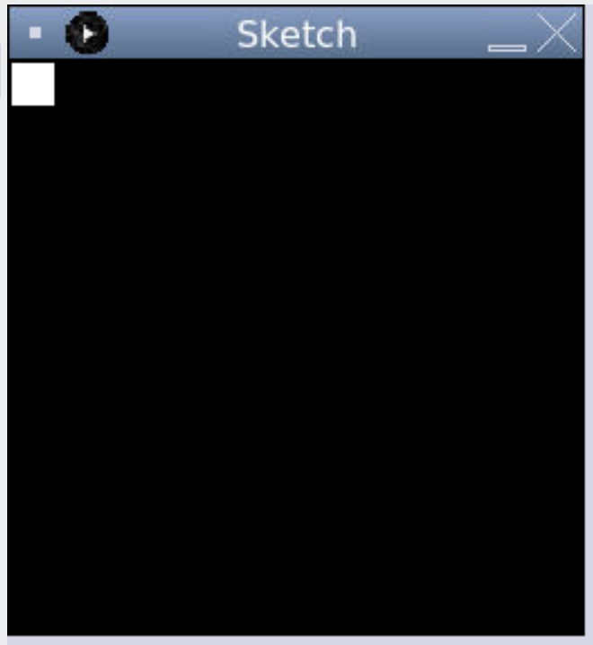
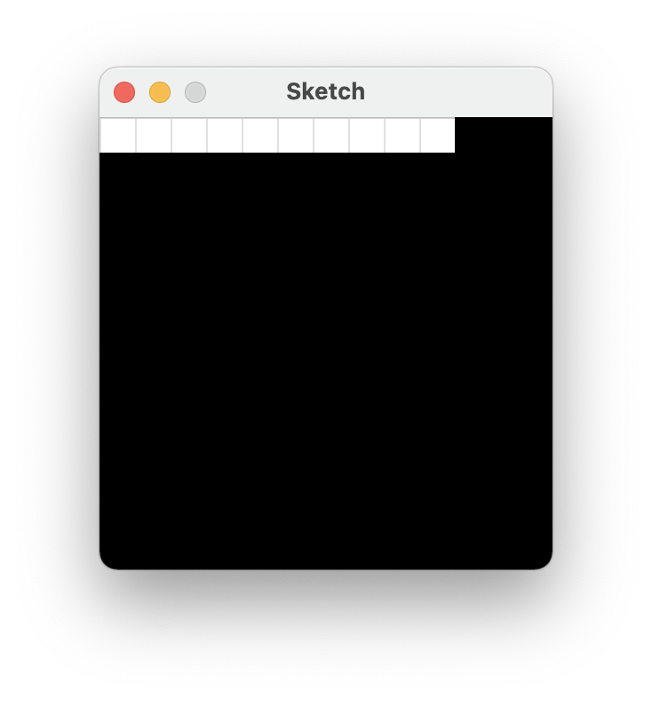
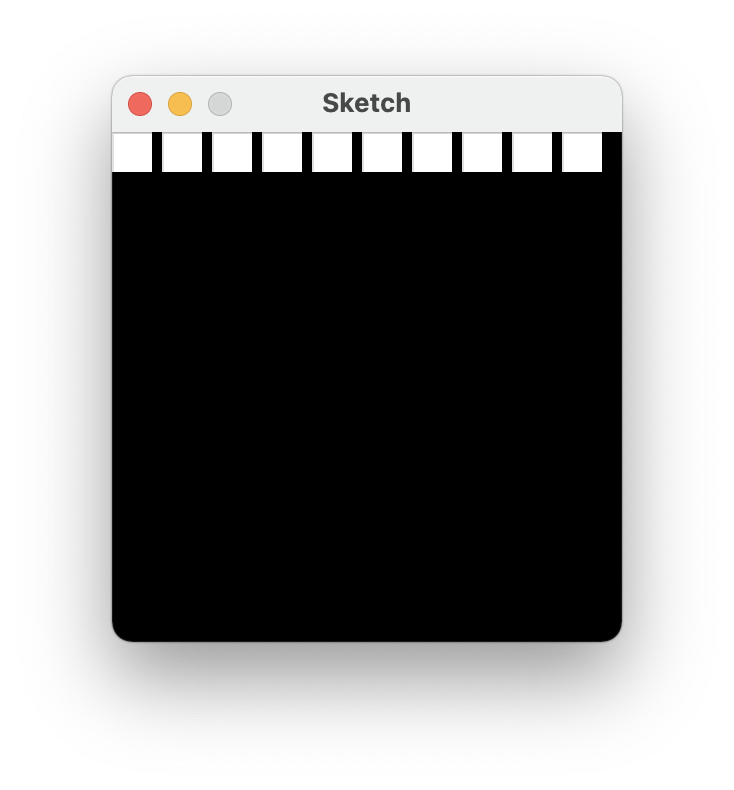
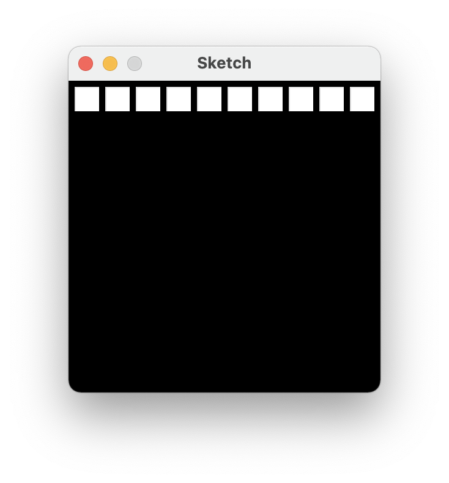
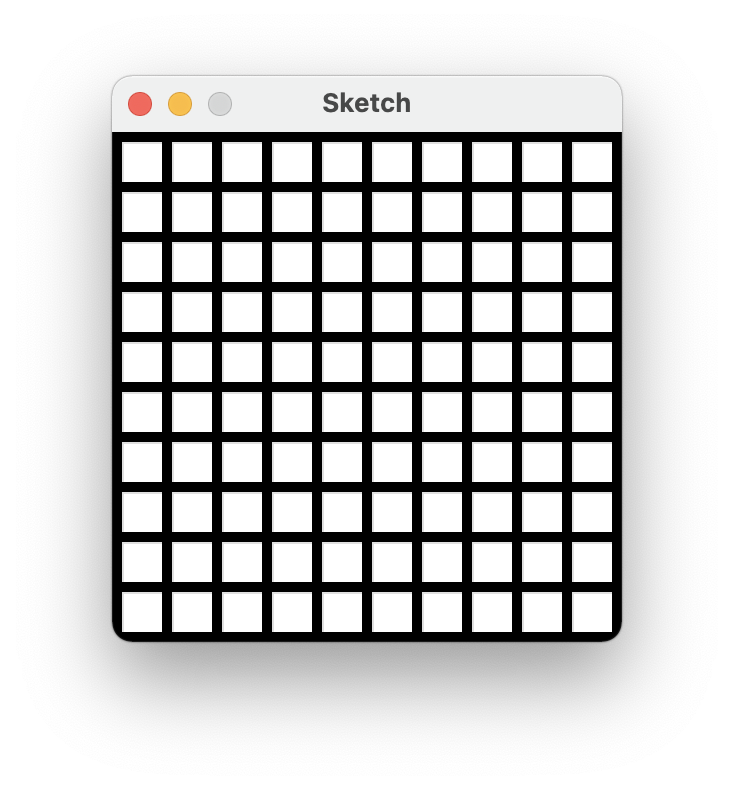
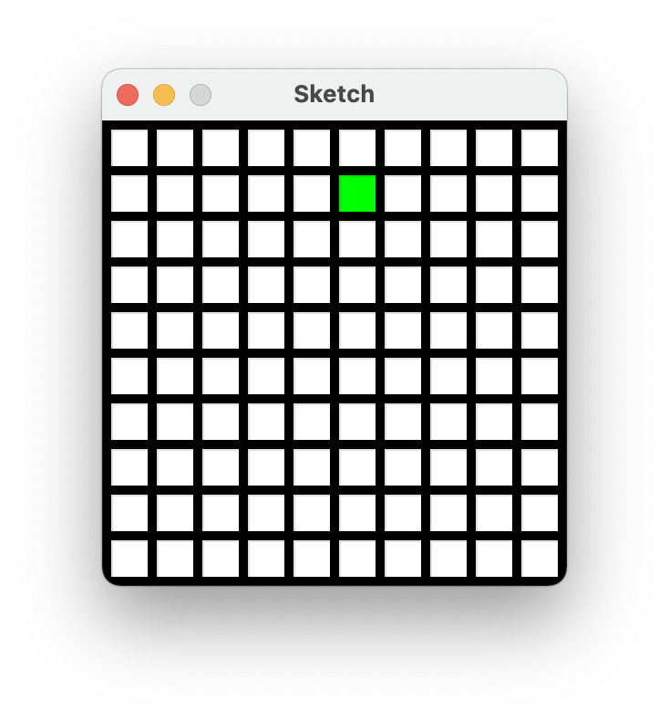
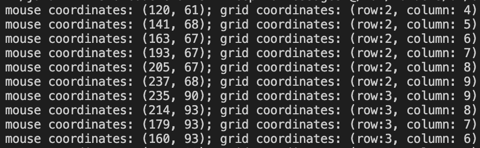
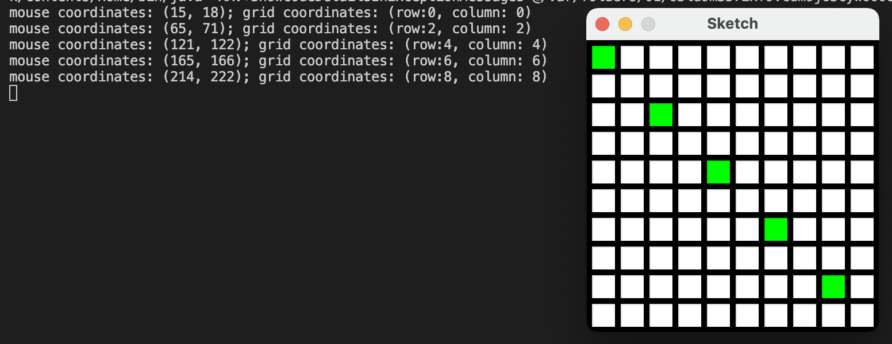

# Array-Backed Grids
----
## Introduction


Games like minesweeper, tic-tac-toe, and many types of adventure games keep
data for the game in a grid of numbers. For example, a tic-tac-toe board:

<table class="tg">
<thead>

<tbody>
  <tr>
    <td class="tg-c3ow"></td>
    <td class="tg-c3ow">0</td>
    <td class="tg-c3ow">0</td>
  </tr>
  <tr>
    <td class="tg-c3ow"></td>
    <td class="tg-c3ow">x</td>
    <td class="tg-c3ow"></td>
  </tr>
  <tr>
    <td class="tg-c3ow">x</td>
    <td class="tg-c3ow"></td>
    <td class="tg-c3ow"></td>
  </tr>
</tbody>
</table>

. . . can use a grid of numbers to represent the empty spots, the O's and the
X's like this:


<table class="tg">
<thead>

<tbody>
  <tr>
    <td class="tg-c3ow"></td>
    <td class="tg-c3ow">2</td>
    <td class="tg-c3ow">2</td>
  </tr>
  <tr>
    <td class="tg-c3ow"></td>
    <td class="tg-c3ow">1</td>
    <td class="tg-c3ow"></td>
  </tr>
  <tr>
    <td class="tg-c3ow">1</td>
    <td class="tg-c3ow"></td>
    <td class="tg-c3ow"></td>
  </tr>
</tbody>
</table>

This grid of numbers can also be called a *two-dimensional* array or a *matrix*.
(Finally, we get to learn about The Matrix.) The values of the numbers in the
grid represent what should be displayed at each board location. In the prior
example, 0 represents a spot where no one has played, a 1 represents an X, and
a 2 represents an O.


    Figure 1: Minesweeper game, showing the backing grid of numbers

The figure above is an example from the classic minesweeper game. This example
has been modified to show both the classic display on the left, and the grid of
numbers used to display the board on the right.

The number ``10`` represents a mine, the number ``0`` represents a space that
has not been clicked, and the number 9 represents a cleared space. The numbers
``1`` to ``8`` represent how many mines are within the surrounding eight
squares, and is only filled in when the user clicks on the square.

Minesweeper can actually have two grids. One for the regular display, and a
completely separate grid of numbers that will track if the user has placed
"flags" on the board marking where she thinks the mines are.

Classic adventure game maps are created using a tiled map editor. These are
huge grids where each location is simply a number representing the type of
terrain that goes there. The terrain could be things like dirt, a road, a
path, green grass, brown grass, and so forth. Programs like [Tiled](http://www.mapeditor.org/) shown in
the figure below allow a developer to easily make these maps and write the grid to
disk.


    Figure 2: Using Tiled Map Editor to create an adventure map

Adventure games also use multiple grids of numbers, just like minesweeper has
a grid for the mines, and a separate grid for the flags. One grid, or "layer,"
in the adventure game represents terrain you can walk on; another for things
you can't walk on like walls and trees; a layer for things that can instantly
kill you, like lava or bottomless pits; one for objects that can be picked up
and moved around; and yet another layer for initial placement of monsters.

Maps like these can be loaded in a Processing program.  Check out this tutorial on how to create a tile map in Processing.

* https://www.youtube.com/watch?v=5MxK9scCpC8
## Application
-----------

Enough talk, let's write some code. This example will create a grid that will
trigger if we display a white or green block. We can change the grid value and
make it green by clicking on it. This is a first step to a grid-based game
like minesweeper, battleship, connect four, etc. 

Start with this template:

```java
import processing.core.PApplet;

public class Sketch extends PApplet {
	
  /**
   * Called once at the beginning of execution, put your size all in this method
   */
  public void settings() {
    // put your size call here
    size(500, 600);
  }

  /** 
   * Called once at the beginning of execution.  Add initial set up
   * values here i.e background, stroke, fill etc.
   */
  public void setup() {
    background(255,255,255);
  }

  /**
   * Called repeatedly, anything drawn to the screen goes here
   */
  public void draw() {
	  
  }

  public void mousePressed(){
    
  }
}
```

Starting with the file above, attempt to recreate this program
following the instructions here. The final program is at the end of this
chapter but don't skip ahead and copy it! 

### Drawing the Grid
------

1. Create global variables named ``CELL_WIDTH``, ``CELL_HEIGHT``, and ``MARGIN``. Set the cell width
   and cell height to 20. This will represent how large each grid location is. Set
   the margin to 5. This represents the margin between each grid location and
   the edges of the screen. Create these variables at the top of the program.
   Also create variables ``ROW_COUNT`` and ``COLUMN_COUNT``. Set them to 10.
   This will control how many rows and columns we will have.
   
3. Create global ``SCREEN_WIDTH`` and ``SCREEN_HEIGHT``  and calculate  based on the variables we
   created above. If we have 10 rows, and each row is 20 high, that's 200 pixels.
   If we have 10 rows, that's also 11 margins. (Nine between the cells and two on
   each edge.) That is 55 more pixels for a total of 255. Write the equation
   so it works with whatever we select in the constants created by step 1.
   
5. Change the background to black. Draw a white box in the top-left corner. Draw the box drawn using the
   cell height and cell width variables created earlier. (Feel free to adjust the colors.).
   When you get done your program's window should look like:

  <p align="center">
    
  </p>

    Figure 3: Step 3

4. Use a ``for`` loop to draw ``COLUMN_COUNT`` boxes in a row. Use ``column``
   for the variable name in the ``for`` loop. The output will look like one
   long box until we add in the margin between boxes. See Figure 4.

<p align="center">
    
  </p>

    Figure 4: Step 4

5. Adjust the drawing of the rectangle to add in the ``MARGIN`` variable. Now
   there should be gaps between the rectangles. See Figure 5.

<p align="center">
    
  </p>

    Figure 5: Step 5

6. Add the margin before drawing the rectangles, in addition to between each
   rectangle. This should keep the box from appearing right next to the window
   edge. See Figure 6. 

<p align="center">
    
  </p>

    Figure 6: Step 6

7. Add another ``for`` loop that also will loop for each row. Call the variable in
   this ``for`` loop ``row``. Now we should have a full grid of boxes. See Figure 7.

<p align="center">
    
  </p>

    Figure 7: Step 7

## Populating the Grid
------

8. Now we need to create a two-dimensional array of integers, call it `intGrid`. We need to create this once, at program
   start-up. So this will go at the top of your code, below your `class` statement.  The array should be a 10x10 array of ints.  You will set the dimensions of the 2D array in your `setup()` method.  Remember, by default, the array element values will be set to 0.
   

9. Set an example location in the array to 1.

```
    intGrid[1][5] = 1;
```

Place this code somewhere before the nested loop that draws the grid of rectangles.

10. Turn your attention to the line of code that draws each rectangle of the grid.

11. Select the color of the rectangle to be drawn based on the value in the `intGrid` array. Place an if statement that looks at the value in
    `intGrid[row][column]` and draws a green retangle when the value of `intGrid[row][column]`is
    equal to 1, otherwise draw a white rectangle=. There should now be one green square. See Figure 8.

    <p align="center">
        
    </p>
    
    Figure 8: Step 11


12. Print "click" to the console if the user clicks the mouse button.

13. Print the mouse coordinates when the user clicks the mouse.

14. Convert the mouse coordinates into grid coordinates print them along side the mouse coordinates. Remember to use the `CELL_WIDTH` and `CELL_HEIGHT`
    combined with the margin. It will be necessary to convert the final
    value to an integer. See Figure 9.

    <p align="center">
        
    </p>

    Figure 9: Step 14

15. Set the grid location at the row/column clicked to 1. See Figure 10.

<p align="center">
        
    </p>

    Figure 10: Step 15 

The resulting program is an interactive that colours any cell clicked on green.